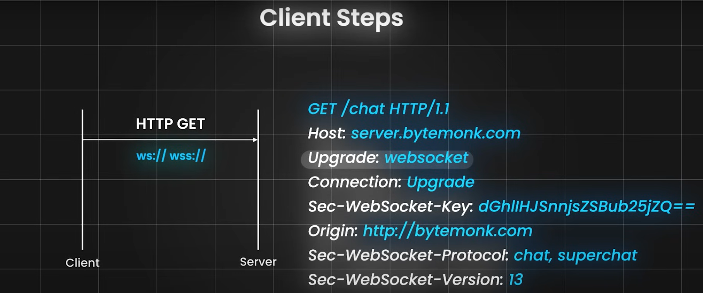
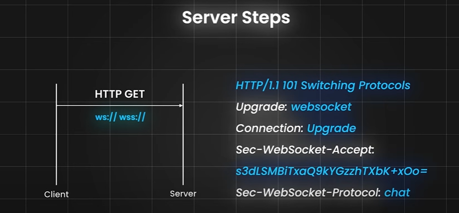
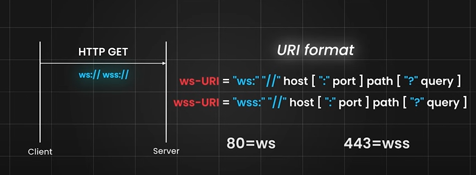
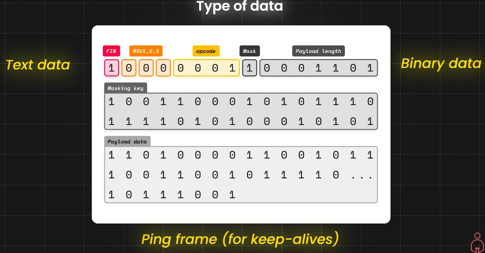

The video titled "WebSocket Handshake Explained" delves into the intricate mechanics of WebSocket connections, focusing on the handshake process that establishes real-time communication between clients (browsers) and servers. 

**Key Topics Covered:**

- **WebSocket Basics Recap**: The video begins by revisiting the fundamental differences between traditional HTTP connections and WebSocket connections, emphasizing that WebSockets maintain a persistent connection, unlike HTTP, which opens and closes connections for each request.

- **Handshake Process**: The core of the video is an in-depth explanation of the WebSocket handshake. It details how a client initiates a connection by sending an HTTP GET request with specific headers to indicate an upgrade to WebSocket. Key headers include:
  - `Upgrade: websocket`
  - `Connection: Upgrade`
  - `Sec-WebSocket-Key`: A unique base64 encoded string used for verification.

- **Server Response**: Upon receiving the request, the server checks the headers and responds with a status code of 101 (Switching Protocols) if the handshake is valid. The server also generates a `Sec-WebSocket-Accept` header to confirm the connection.

- **Data Transmission**: Once the handshake is successful, data can be exchanged using frames. The video explains frame structure, including fields for final fragments, reserved bits, opcode types, masking, and payload length.

- **Masking and Fragmentation**: Masking is discussed as a technique to prevent intermediaries from misinterpreting WebSocket data as traditional HTTP traffic. Fragmentation allows large messages to be split into smaller parts to avoid buffer overflow issues.

- **Applications of WebSockets**: The video concludes with examples of real-world applications such as chat applications, online gaming, and stock market updates that benefit from WebSocket technology.

Overall, this deep dive into WebSockets aims to equip viewers with a comprehensive understanding of how they function and their importance in building real-time applications.

**WebSocket Handshake:** This is the initial negotiation between a client (like a web browser) and a server to upgrade an HTTP connection to a WebSocket connection. The client sends an HTTP GET request with specific headers, including Upgrade: websocket, Connection: Upgrade, and a randomly generated Sec-WebSocket-Key. The server verifies the request, generates a Sec-WebSocket-Accept header (based on the client's key), and responds with an HTTP status code 101 (Switching Protocols). This confirms the successful upgrade, and both client and server can then exchange data using the WebSocket protocol over a persistent TCP connection. The Sec-WebSocket-Key and Sec-WebSocket-Accept headers are crucial for security and authentication.

**Masking:** This technique obscures the payload data in WebSocket frames sent from the client to the server. This prevents intermediaries (like caching proxies) from incorrectly interpreting the data as HTTP content and potentially caching or modifying it. Masking makes WebSocket traffic distinctly different from HTTP, thus avoiding potential issues.

**Fragmentation:** This involves splitting large messages into smaller chunks (frames) for transmission. This is useful for handling very large messages that might overwhelm the connection or exceed buffer limitations. Each fragment has a fin bit indicating whether it's the final fragment; a value of 0 means more fragments will follow, while 1 signals the last fragment. Fragmentation allows for gradual delivery and processing of large messages.

Citations:
[1] https://www.youtube.com/watch?v=G0_e02DdH7I

The Socket.IO documentation provides a comprehensive overview of the Socket.IO library, which facilitates **low-latency**, **bidirectional**, and **event-based** communication between clients and servers. Here are the key points covered in the documentation:

## Overview of Socket.IO
- **Purpose**: Socket.IO enables real-time communication by establishing connections using various low-level transports such as HTTP long-polling, WebSocket, and WebTransport. It automatically selects the best option based on browser capabilities and network conditions[1].

## Server and Client Implementations
- **Server Implementations**: Socket.IO supports multiple programming languages including JavaScript (Node.js), Java, Python, Golang, and Rust. Each language has its own installation steps and API references.
- **Client Implementations**: Similar support exists for client libraries across various platforms like JavaScript (browser, Node.js), Java, C++, Swift, Dart, .NET, Kotlin, and PHP[1].

## Distinction from WebSockets
- **Not a WebSocket Implementation**: While Socket.IO can use WebSocket for transport, it is not a plain WebSocket implementation. It adds metadata to packets, meaning that standard WebSocket clients cannot connect to a Socket.IO server[1].

## Features of Socket.IO
- **Fallback Mechanism**: If a WebSocket connection fails, Socket.IO falls back to HTTP long-polling, ensuring robust connectivity.
- **Automatic Reconnection**: The library includes a heartbeat mechanism to check connection status and automatically reconnects when necessary. And when the client eventually gets disconnected, it automatically reconnects with an exponential back-off delay, in order not to overwhelm the server.
- **Packet Buffering**: Messages are buffered during disconnections and sent upon reconnection.
- **Acknowledgements**: Socket.IO allows for event acknowledgment between the sender and receiver.
- **Broadcasting**: Events can be sent to all connected clients or specific groups.
- **Multiplexing**: Namespaces enable splitting application logic over a single connection for different user roles[1].

## Common Questions
- The documentation addresses whether Socket.IO is still relevant today despite widespread WebSocket support. It argues that many features provided by Socket.IO would need to be implemented manually if using plain WebSockets.
- It also discusses the overhead of the Socket.IO protocol compared to standard WebSocket messages[1]. 

Overall, the documentation serves as a detailed guide for developers looking to implement real-time communication in their applications using Socket.IO.

**What is the overhead of the Socket.IO protocol?**
socket.emit("hello", "world") will be sent as a single WebSocket frame containing 42["hello","world"] with:

4 being Engine.IO "message" packet type
2 being Socket.IO "message" packet type
["hello","world"] being the JSON.stringify()-ed version of the arguments array
So, a few additional bytes for each message, which can be further reduced by the usage of a custom parser.
Citations:
[1] https://socket.io/docs/v4/

## Redis Streams adapter
#### How it works
The adapter will use a Redis stream to forward packets between the Socket.IO servers.

The main difference with the existing Redis adapter (which use the Redis Pub/Sub mechanism) is that this adapter will properly handle any temporary disconnection to the Redis server and resume the stream without losing any packets.

Notes:

  * a single stream is used for all namespaces
  the maxLen option allows to limit the size of the stream

  * unlike the adapter based on Redis PUB/SUB mechanism, this adapter will properly handle any temporary disconnection to the Redis server and resume the stream
  
  * if connection state recovery is enabled, the sessions will be stored in Redis as a classic key/value pair